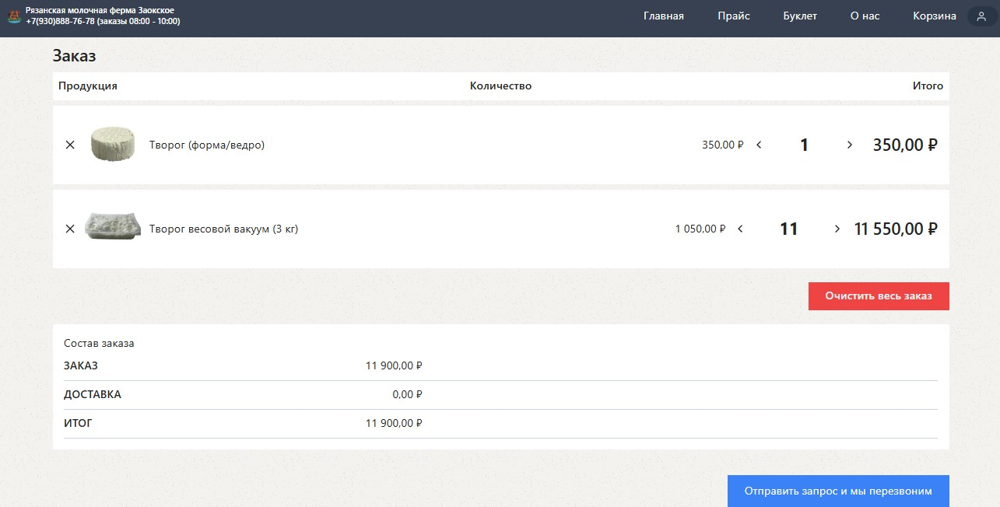
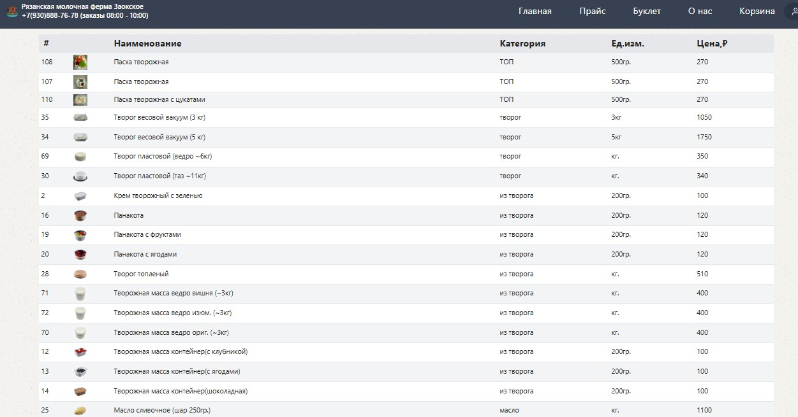
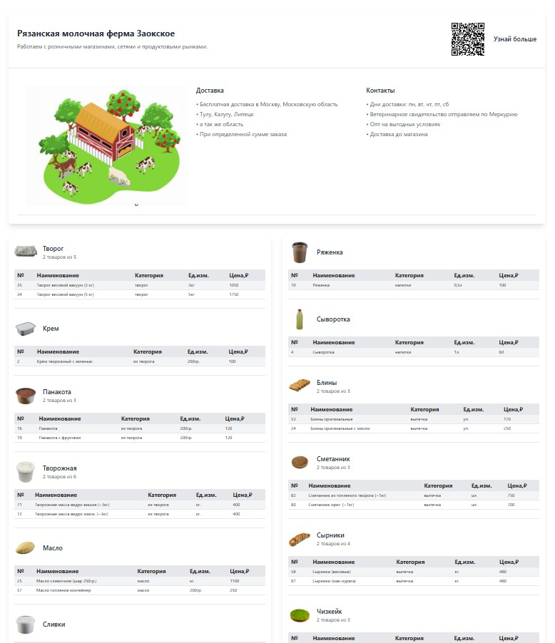

# 🛒 Smart Shop - Интернет-магазин

[](https://nextjs.org/)
[](https://www.typescriptlang.org/)
[](https://tailwindcss.com/)
[](https://redux.js.org/)

> Современный интернет-магазин с админ-панелью, корзиной и полной системой заказов

---

## 📸 Демонстрация






---

## 🌐 Демо

[Посмотреть сайт](https://ryazantvorog.ru/)

---

## ✨ Особенности

- 🎨 **Современный дизайн** с использованием Tailwind CSS
- 🛒 **Корзина** с Redux state management
- 📦 **Каталог товаров** с фильтрацией и поиском
- 📱 **Адаптивный дизайн** для всех устройств
- 🍪 **Cookie-баннер** для GDPR compliance

---

## 🚧 В разработке (будет сделано в будущем)

- 💳 **Оплата** через платежный шлюз
- 📝 **Система заказов** с генерацией чеков
- 👨‍💼 **Админ-панель** для управления товарами и заказами
- 🖨️ **Печать чеков** и документов

---

## 📁 Структура проекта

```
smart_shop/
├── be/                 # Backend (Node.js)
│   ├── admin-login.js  # Админ-авторизация
│   ├── create-admin-table.sql
│   ├── create-db.sql
│   ├── database.js     # База данных
│   └── shuvalov-be.js  # Основной бэкенд
├── nginx/              # Nginx конфигурации
│   ├── default
│   └── shuvalov.conf
├── public/             # Статические файлы
│   ├── static/        # Изображения товаров, логотипы
│   └── *.png, *.jpg, *.pdf
├── src/
│   ├── app/           # Next.js App Router
│   │   ├── api/       # API маршруты
│   │   ├── cart/      # Страница корзины
│   │   ├── order/     # Страница заказа
│   │   ├── price*/    # Страницы прайс-листов
│   │   ├── product/   # Страница товара
│   │   └── *.tsx      # Страницы приложения
│   ├── components/    # React компоненты
│   ├── contexts/      # React Context
│   ├── helpers/       # Утилитарные функции
│   ├── redux/         # Redux store и слайсы
│   └── constants/     # Константы
├── scripts/           # Скрипты развертывания
└── type/              # TypeScript типы
```

---

## 🚀 Установка

### Требования

- Node.js 18+
- npm, yarn или pnpm
- MySQL/PostgreSQL (для бэкенда)

### Клонирование

```bash
git clone <repository-url>
cd smart_shop
```

### Установка зависимостей

```bash
# Frontend
npm install

# Backend
cd be
npm install
```

---

## 🔧 Разработка

### Запуск разработки

```bash
# Frontend
npm run dev

# Backend
cd be && npm start
```

### Сборка для продакшена

```bash
npm run build
npm start
```

### Standalone сборка

```bash
npm run build-standalone
```

---

## 📦 API Маршруты

| Метод | Маршрут | Описание |
|-------|---------|----------|
| GET | `/api/products` | Получить список товаров |
| POST | `/api/checkout` | Оформить заказ |
| POST | `/api/admin/login` | Админ-авторизация |
| POST | `/api/admin/logout` | Админ-деавторизация |
| GET | `/api/admin/verify` | Проверка админ-сессии |

---

## 🗄️ База данных

### Создание базы данных

```bash
cd be
node create-db.sql
```

### Инициализация администратора

```bash
node init-admin.js
```

---

## 📝 Лицензия

MIT License

---

## 🤝 Вклад

Внесение предложений и вклад в проект приветствуется!

---

## 📞 Контакты

Для вопросов и предложений:
- Email: support@ryazantvorog.ru
- Сайт: https://ryazantvorog.ru/
